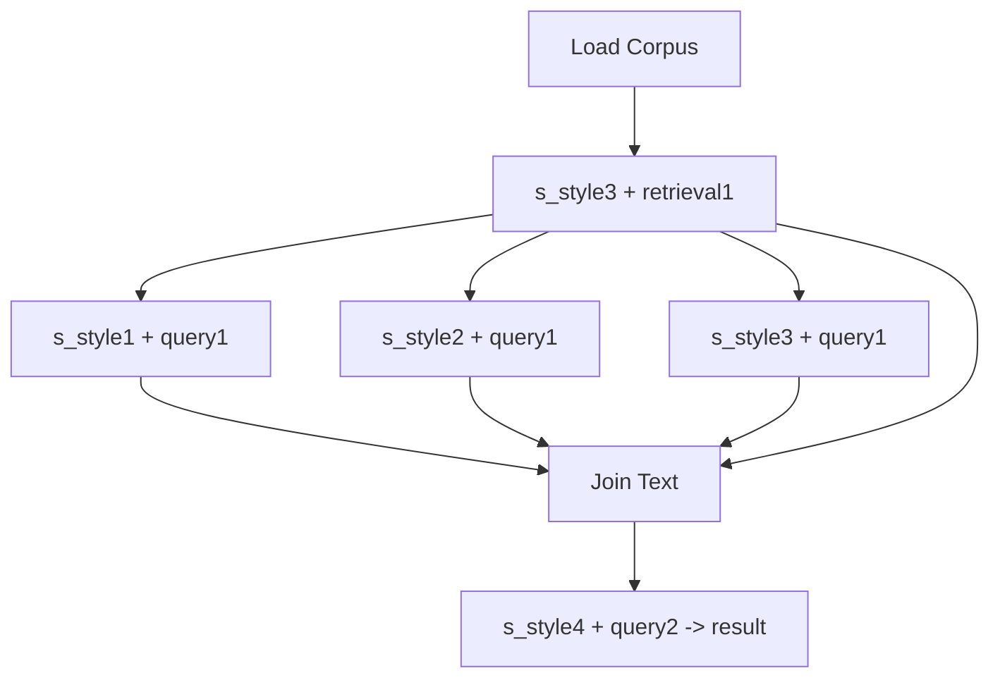

A Pipeline library that does a few things differently to achieve flexibility and abstraction.

Both chains and graphs can be defined in an independent manner from the function details. A `Pipeline` class defines the dependencies for the `Steps` of a chain, and pipeline objects may be swapped in/out.

See the [demo](demo.md) for how to define a concurrent LLM procedure:

